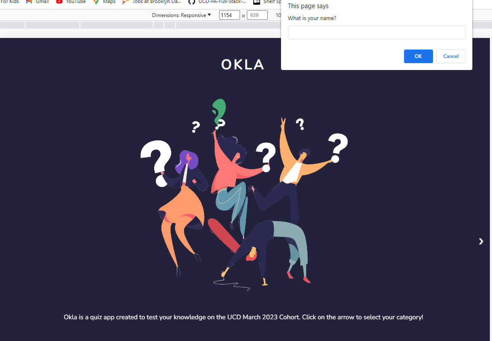
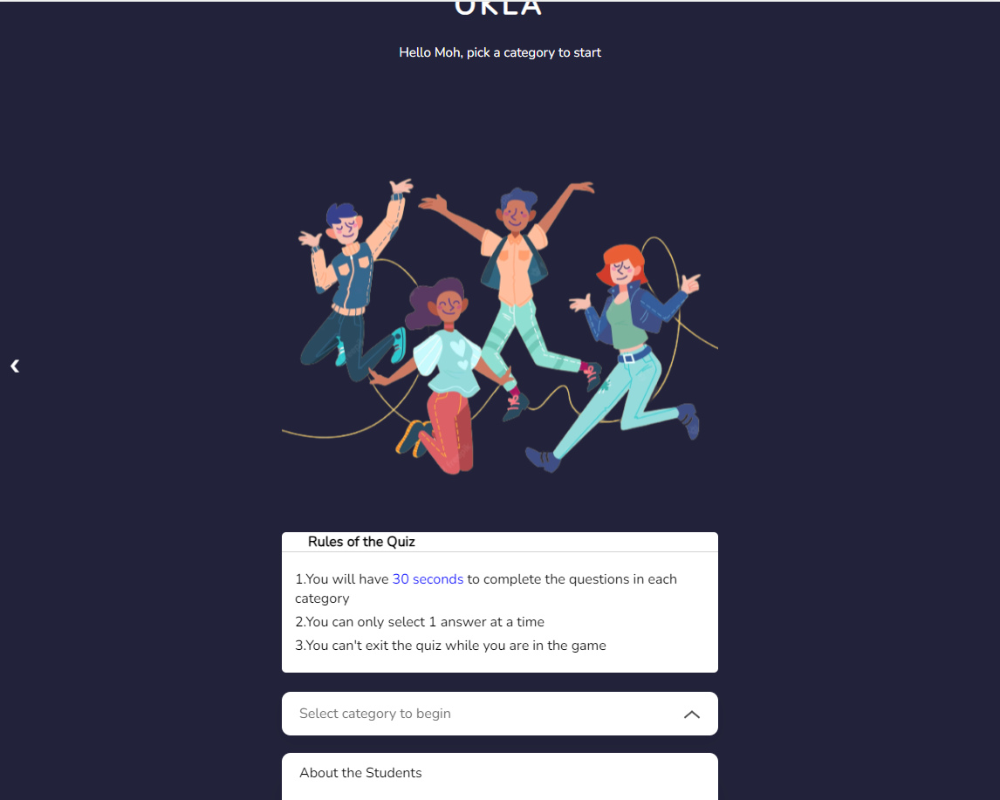
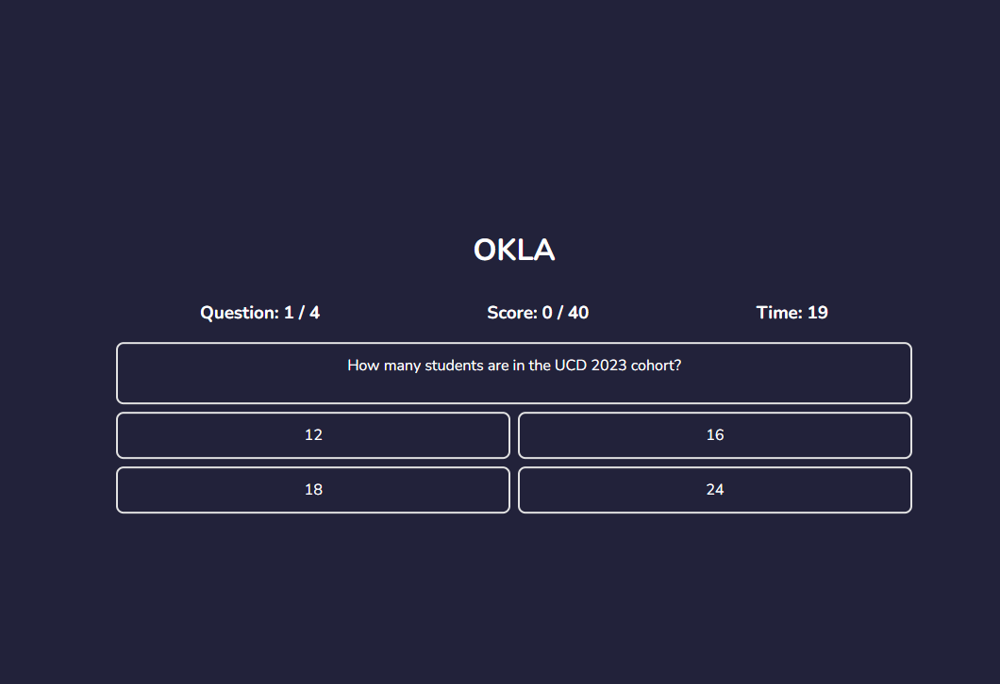
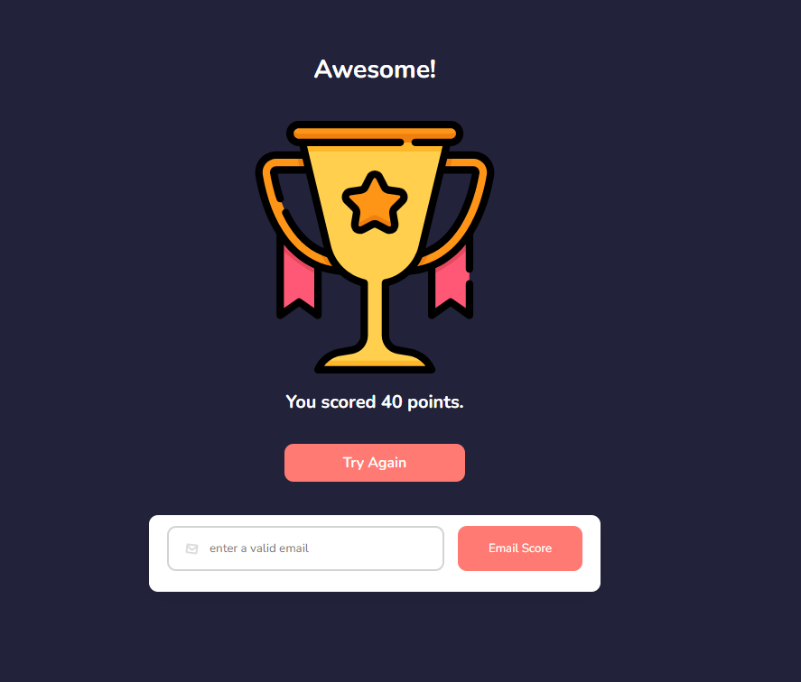

# Okla

# DESCRIPTION
Okla is a Quiz App designed using HTML, CSS and Javascript. The app is a 3-paged site and it allows users to answer questions based on their knowledge of the March 2023 UCD software Engineering Cohort. There are 2 categories - questions about the students and tutor, four questions each. A total score of 40 can be attained and an email validation form was implemented. The app features a timer that can not be restarted with a refresh or user leaving the page. This is my second submission in the course. HTML was used to define the structure of Okla, CSS was used to style while Javascript was used to add interactivity. 

# Links
I hosted the app with Github and it can be accessed through this link: 

# Look and Feel
## Section 1

## Section 2

## Quiz Page

## Score Page

# How to use
Access the app through the link above and enjoy quizzing!

# Built with 
- HTML
- CSS
- Javascript

# Future Updates
- Include a database
- Include Email sending feature

## Author

**Moh**
- [Profile] (https://github.com/Moh-Niz "Moh")
- [Linkedln](https://www.linkedin.com/in/olalekan-akano/ "Muhammed Akano")

